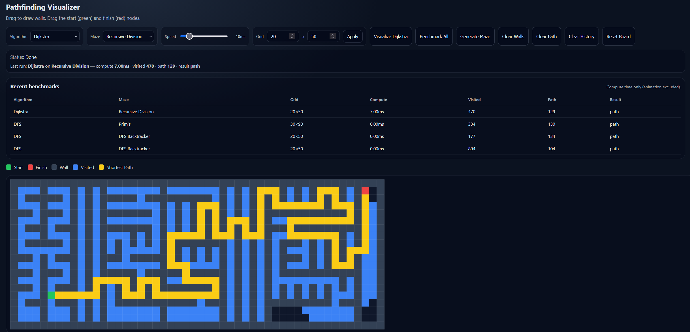

# Pathfinding Visualizer

An interactive, grid-based pathfinding + maze generation visualizer built with **React** and **Vite**.



## Features

- **Interactive grid**: click + drag to draw/erase walls, drag Start (green) and Finish (red), resize the grid.
- **Pathfinding algorithms**: A\*, Dijkstra, BFS, Greedy Best-First, DFS.
- **Visualization**: visited-node animation, shortest-path highlight, speed control, stop mid-run.
- **Benchmarking**: “Benchmark All” measures **compute time only** (animation excluded) and stores a small recent history in `localStorage`.
- **Maze generation**: DFS Recursive Backtracker, Recursive Division, Randomized Prim’s.

## Controls

- **Draw / erase walls**: click + drag on the grid (the first cell you click decides paint vs erase for that drag).
- **Move endpoints**: drag the Start (green) and Finish (red) nodes.
- **Visualize**: runs the selected algorithm and animates visited nodes + (if reachable) the shortest path.
- **Benchmark All**: runs all algorithms on the current grid and records compute time, visited count, path length, and result.
- **Generate Maze / Clear Walls / Clear Path / Clear History / Reset Board**: self-explanatory utility actions.
- **Speed**: controls animation delay per visited node (ms).
- **Grid**: set rows/cols and click Apply.

## Algorithms (notes)

- **Unweighted grid**, 4-directional movement (no diagonals).
- **Shortest-path guaranteed**: A\*, Dijkstra, BFS.
- **Not guaranteed shortest**: Greedy Best-First, DFS.

## Getting started

**Prerequisites**: Node.js **20+ recommended**.

Install dependencies:

```bash
npm install
```

Start the dev server:

```bash
npm run dev
```

## Project structure

- `src/components/PathfindingVisualizer.jsx`: UI, grid state, animations, benchmarking, persistence.
- `src/components/Node.jsx`: grid cell component.
- `src/algorithms/*.js`: pathfinding + maze generator implementations.
- `src/assets/ss1.png`: project screenshot used in this README.
